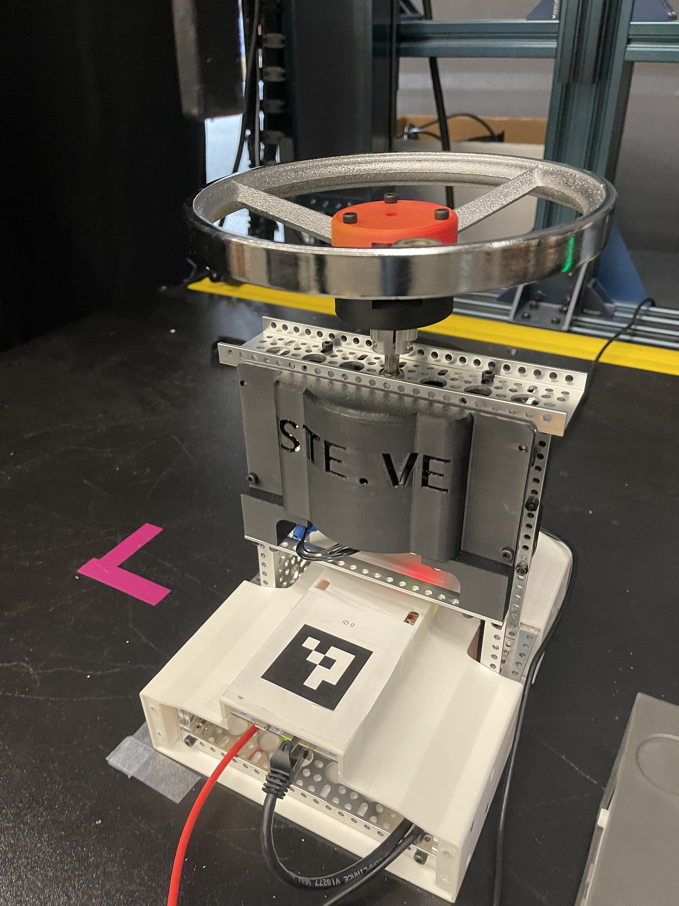
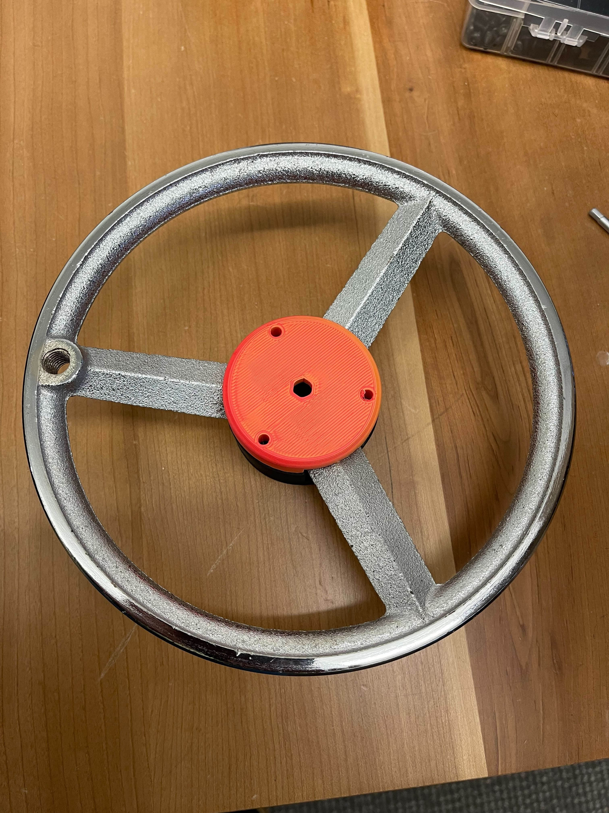
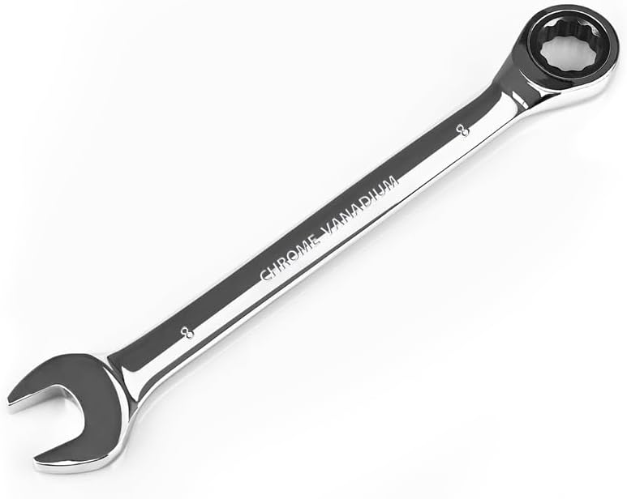
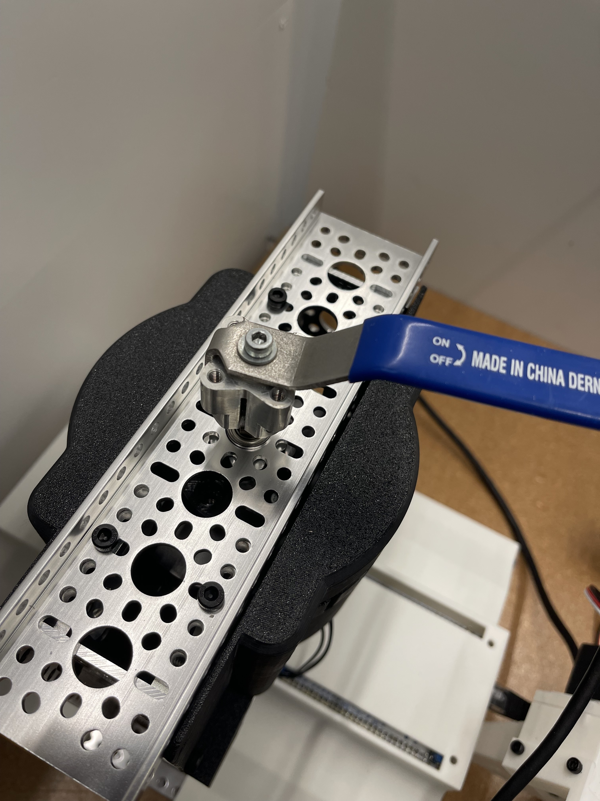

# STEVE: Simulated Task Exploration | Valve Emulation

**Welcome to STEVE** — A low-cost, high-fidelity, multi-purpose benchmark and task emulator for robotics, focused on rotational tasks such as turning valves, handles, knobs, and fasteners.



---

## 🎯 Key Capabilities

<table><tr>
<td align="center">
<br>
<strong>Multi-Task Benchmark</strong><br>
Software-configurable valve/handle behavior
</td>
<td align="center">
<br>
<strong>Quick-Change Interface</strong><br>
Mount any knob/handle instantly
</td>
<td align="center">
<br>
<strong>Haptic Feedback</strong><br>
1+ kHz real-time force rendering
</td>
<td align="center">
<br>
<strong>Reproducible</strong><br>
Standardized hardware & firmware
</td>
</tr></table>

---

## Multi-Task Benchmark: Realistic Rotational Task Simulation

STEVE provides a versatile platform for benchmarking robotic manipulation on rotational tasks. Each task simulates realistic physical properties:

- **Configurable valve characteristics** — damping, friction, stiffness, detents
- **Variable initial states** — randomized task difficulty levels
- **Real-time task feedback** — telemetry for success determination
- **Self-resetting tasks** — no manual intervention between attempts
- **Diverse task sub-types** — Software presets and hardware BOMs for hydrant-style handwheel and quarter-turn valves, wrench tightening of fasteners, and door handle behaviors with a systemized approach to contributing new types.

### Video Demo

**[Video Placeholder: STEVE in action]**
_Real-world valve turning benchmark (2x speed)_

<video id="steve-demo" src="docs/assets/Lerobot_Example.MOV" controls width="640" autoplay muted loop playsinline>
	Your browser does not support the video tag.
</video>

<p align="center">
  <em>Demo: STEVE rotational benchmark (autoplay, 2x where supported)</em><br>
  <a href="docs/assets/Lerobot_Example.MOV">Download video</a>
</p>

---

## System Architecture

**STEVE Hardware** consists of:

1. **STEVE DEVICE** — Physical STEVE unit including power supply, drive motor, controllers, etc.
2. **Selectable Handle** — Handles, knobs, or other rotation interface 

**STEVE Software** consists of:

1. **Firmware** — STM32H753ZI bare-metal C with lwIP, CAN FD, Ethernet, REST API, CLI
2. **Motor Control** — ODrive S1 brushless motor controller via CAN
3. **Python Client** — `pysteve` library with integrations for MuJoCo, Gymnasium, ROS 2, Isaac Sim

---

## Quick Start

### Firmware (C/STM32H7)

```bash
cd firmware && make && make flash
# Connect serial: screen /dev/ttyACM0 115200
# Try: odrive_enable, valve_start, valve_preset smooth
```

See [Firmware Installation](docs/firmware/firmware-installation.md).

### Python Client

```python
pip install -e client/
from pysteve import SteveClient

steve = SteveClient("192.168.1.100")
steve.valve_start(preset="smooth")
status = steve.get_status()
```

See [Python Examples](client/examples/).

---

## Reproducible Environment

To ensure reproducibility, STEVE uses widely available components:

- **"GoBilda" robotics build system componts** (8mm REX shaft standard)
- **COTS hardware** — Nucleo-H753ZI, ODrive S1, off-the-shelf handles
- **Open firmware** — MISRA-C:2012 compliant, modular design
- **Standardized task initialization** — GUI tool for state randomization

### Task Randomness Levels

| Level | Difficulty | Use Case |
|-------|-----------|----------|
| **Low** | Fixed initial state | Algorithm development |
| **Medium** | Bounded randomization | Generalization testing |
| **High** | Maximum variation | Out-of-distribution robustness |

---

## Benchmark Results

### Single-Task Performance

**[Visualization Placeholder: Policy success rates by handle type]**

Baseline RL algorithms (BC, IQL) achieve varying performance across tasks:
- Hydrant Handwheel: High success on smooth turns, challenges on detent escape
- Quarter-Turn: Robust with proper alignment control
- Wrench Tightening: Requires precise torque feedback

### Full-Rotation Benchmark

**[Video Placeholder: BC policy on multi-turn task]**
_Best-performing policy achieves 3 of 4 turns before slipping_

---

## Handle Library

STEVE's modular handle system allows custom designs. Contribute new handles via our structured catalog:

- **[Handle Library](docs/CAD/Handles/README.md)** — View all available handles
- **[handles.json](docs/CAD/Handles/handles.json)** — Structured metadata
- **[Auto-Generated Catalog](docs/CAD/Handles/catalog.md)** — Updated catalog with images & BOM

Current handles:
- 🔴 Hydrant Handwheel (4-turn industrial design)
- 🟡 Quarter-turn Handle (90° rotation)
- 🔵 Wrench Tightening (fastener task)

---

## Datasets

Coming soon: Pre-collected demonstrations and benchmark datasets for offline RL training.

---

## Projects Using STEVE

<!-- Placeholder for projects that use STEVE -->

- Your research project here — [Submit a PR!](https://github.com/Emroess/STE-VE/pulls)

---

## Documentation

- **[Main Hub](docs/README.md)** — Complete reference
- **[Firmware Setup](docs/firmware/firmware-installation.md)**
- **[Getting Started](docs/getting-started/getting-started.md)**
- **[CLI Reference](docs/cli/cli-reference.md)** | **[REST API](docs/rest/rest-api.md)** | **[Streaming](docs/stream/streaming-guide.md)**
- **[Handle Design Guide](docs/CAD/Handles/README.md)** — Contribute custom handles

---

**Ready to benchmark your manipulation algorithm?**

- **[Firmware Installation](docs/firmware/firmware-installation.md)** — Set up STEVE
- **[Python Examples](client/examples/)** — Start coding
- **[Documentation Hub](docs/README.md)** — Learn more

---

_STEVE: Benchmarking realistic rotational task manipulation for robotics research._
