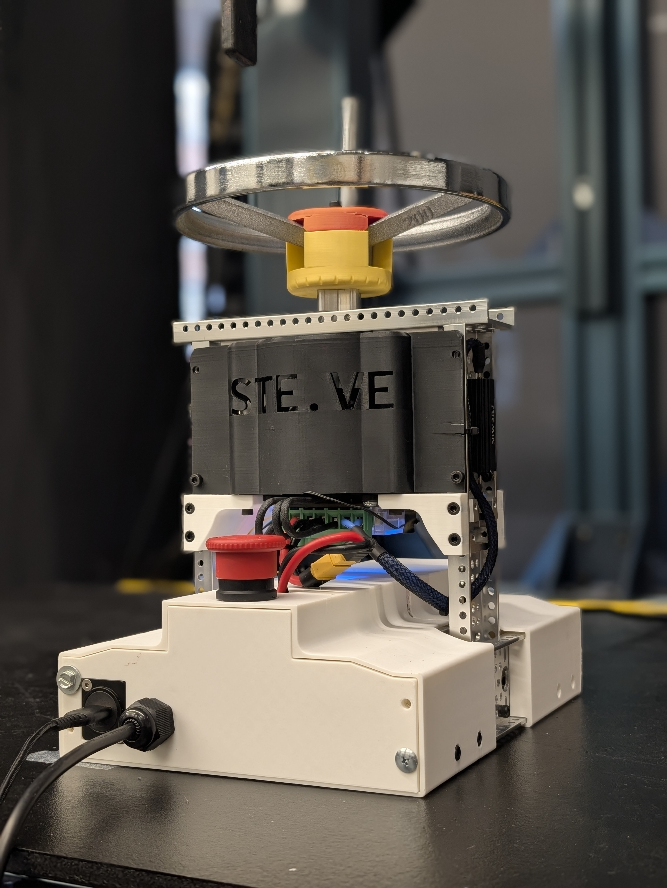
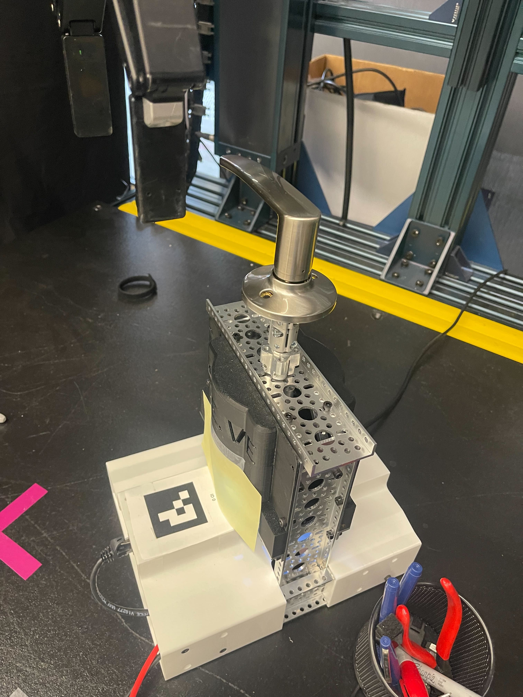
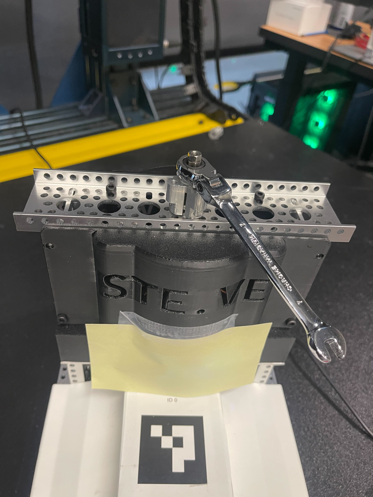
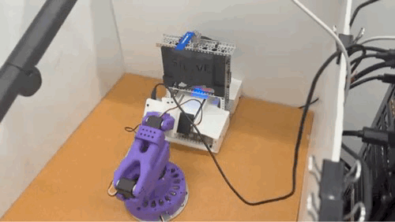

<div align="center">

   <h1>PRISM: Programmable Rotary Impedance Suite for Manipulation </h1>
   <div style="display: flex; gap: 1rem; justify-content: center; align-items: center;" >
   
   
</div>

<h2>
    <p>Introduction</p>
</h2>
An open-source, low-cost task emulator engineered to replicate the dynamics of real-world valves, handles, knobs, etc. 

PRISM can be used for robotic policy training, as a benchmark tool, or to emulate virtually any real-world rotational behavior. 
</div>

> ℹ️  NOTE: Project is currently going through a renaming. Documentation may have STEVE and not yet be changed to PRISM. 

## 🎯 Key Capabilities

### Multi-Task Benchmark — Realistic rotational task simulation

<table style="width:100%"><tr>
<td align="center" style="width:25%">
<br>
<strong>Multi-turn valves</strong><br>
</td>
<td align="center" style="width:25%">
<br>
<strong>Quarter-turn Valves</strong><br>
</td>
<td align="center" style="width:25%">
<br>
<strong>Door Handles</strong><br>
</td>
<td align="center" style="width:25%">
<br>
<strong>Fastener Tighting</strong><br>
</td>
</tr></table>

PRISM simulates common rotational tasks (valves, handles, fasteners) with configurable physical behavior and reproducible randomness. 
<div align="center">
  
### Key Features
</div>

- Configurable dynamics: Damping, friction, stiffness, and endstops
- Controlled randomness: REPEATABLY emulate real-world rotational physics such as sticking or rusty rotation targets 
- Real-time telemetry: position, torque/force and other signals for success detection
- Velocity Maximums: Prevents dammage to robotic manipulators or PRISM
- Self-resetting tasks and software presets for common sub-types (handwheel, quarter-turn, wrench, door handle)

---

### Video Demo

<p align="center">
  
</p>

<p align="center">
  <em>Demo: PRISM rotational benchmark in action</em>
</p>

---

## System Architecture

**PRISM Hardware** consists of:

1. **PRISM DEVICE** — Physical PRISM unit including power supply, drive motor, controllers, etc.
2. **Selectable Handle** — Handles, knobs, or other rotation interface 

**PRISM Software** consists of:

1. **Firmware** — STM32H753ZI bare-metal C with lwIP, CAN FD, Ethernet, REST API, CLI
2. **Motor Control** — ODrive S1 brushless motor controller via CAN
3. **Python Client** — `pysteve` library with integrations for MuJoCo, Gymnasium, ROS 2, Isaac Sim

---

## Quick Start

### Firmware (C/STM32H7)

```bash
cd firmware && make && make flash
# Connect serial: screen /dev/ttyACM0 115200
# Try: odrive_enable, valve_start, valve_preset smooth
```

See [Firmware Installation](docs/firmware/firmware-installation.md).

### Python Client

```python
pip install -e client/
from pysteve import SteveClient

steve = SteveClient("192.168.1.100")
steve.valve_start(preset="smooth")
status = steve.get_status()
```

See [Python Examples](client/examples/).

---

## Reproducible Environment

To ensure reproducibility, STEVE uses widely available components:

- **"GoBilda" robotics build system componts** (8mm REX shaft standard)
- **COTS hardware** — Nucleo-H753ZI, ODrive S1, off-the-shelf handles
- **Open firmware** — MISRA-C:2012 compliant, modular design
- **Standardized task initialization** — GUI tool for state randomization

## Benchmark Results

#### --> TODO ADD RESULTS
---

## Handle Library

STEVE's modular handle system allows custom designs. Contribute new handles via our structured catalog:

- **[Handle Library](docs/CAD/Handles/README.md)** — View all available handles
- **[handles.json](docs/CAD/Handles/handles.json)** — Structured metadata
- **[Auto-Generated Catalog](docs/CAD/Handles/catalog.md)** — Updated catalog with images & BOM

Current handles:
- 🟢 Hydrant Handwheel (4-turn industrial design)
- 🟢 Quarter-turn Handle (90° rotation)
- 🟢 Door Handle (+/- 45° rotation with self-centering)
- 🟢 Wrench Tightening (fastener task)

---

## Datasets

Coming soon: Pre-collected demonstrations and benchmark datasets for offline RL training.

---

## Projects Using STEVE

<!-- Placeholder for projects that use STEVE -->

- Your research project here — [Submit a PR!](https://github.com/Emroess/STE-VE/pulls)

---

## Documentation

- **[Main Hub](docs/README.md)** — Complete reference
- **[Firmware Setup](docs/firmware/firmware-installation.md)**
- **[Getting Started](docs/getting-started/getting-started.md)**
- **[CLI Reference](docs/cli/cli-reference.md)** | **[REST API](docs/rest/rest-api.md)** | **[Streaming](docs/stream/streaming-guide.md)**
- **[Handle Design Guide](docs/CAD/Handles/README.md)** — Contribute custom handles

---

**Ready to benchmark your manipulation algorithm?**

- **[Firmware Installation](docs/firmware/firmware-installation.md)** — Set up STEVE
- **[Python Examples](client/examples/)** — Start coding
- **[Documentation Hub](docs/README.md)** — Learn more

---

_STEVE: Benchmarking realistic rotational task manipulation for robotics research._
