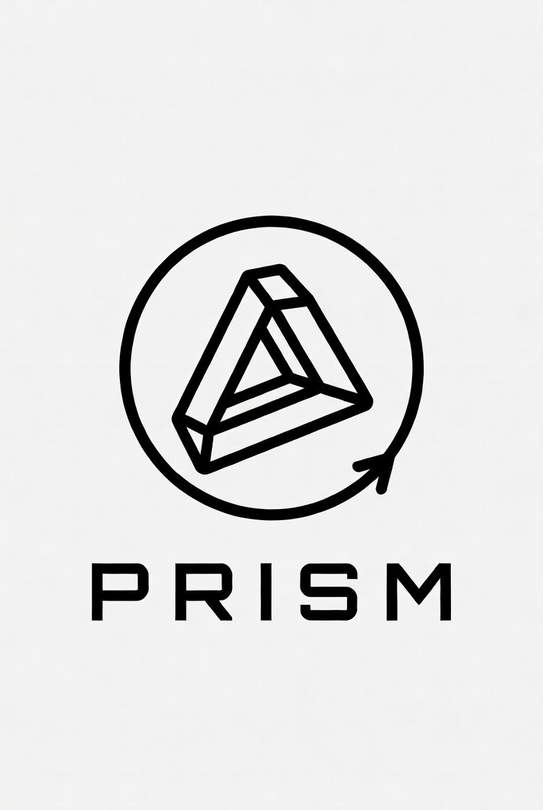

<div align="center">
  
</div>

# PRISM

An open-source, programmable rotary impedance suite for emulating realistic task haptics.

[](https://github.com/Emroess/PRISM)
[](https://github.com/Emroess/PRISM)
[](https://github.com/Emroess/PRISM)

---

## Table of Contents
- [Getting Started](#getting-started)
- [Usage](#usage)
- [Emulation Library](#emulation-library)
- [Features](#features)
- [Contributing](#contributing)
- [License](#license)

## About / Overview
PRISM (Programmable Rotary Impedance Suite for Manipulation) is an advanced haptic control system engineered to replicate the dynamics of real-world valves, handles, knobs, and fasteners. It provides precise force feedback through a high-performance motor-driven interface.

PRISM can be used for robotic policy training, as a benchmark tool, or to emulate virtually any real-world rotational behavior with configurable physical parameters such as damping, friction, and wall stiffness.

## Getting Started
Set up and build your PRISM hardware and firmware. For detailed instructions, refer to the [**Getting Started Docs**](docs/getting-started.md).

### Prerequisites
- [STM32 Nucleo-H753ZI](https://www.st.com/en/evaluation-tools/nucleo-h753zi.html)
- [ODrive S1 Motor Controller](https://odriverobotics.com/)
- Python 3.10+
- GNU ARM Embedded Toolchain & Make

### Installation
```bash
git clone https://github.com/Emroess/PRISM.git
cd STE-VE/firmware
make && make flash
```

## Usage
Control PRISM via the Command Line, REST API, Web Interface, or Python Client. See the [**Usage Docs**](docs/usage.md) for full references.

To start using the Python client:
```bash
pip install -e client/
```
```python
from pysteve import SteveClient

steve = SteveClient("192.168.1.100")
steve.valve_start(preset="smooth")
```

## Emulation Library
PRISM's modular handle system allows for custom haptic emulations. See the [**Emulation Library Docs**](docs/emulation-library.md) for 3D printable designs and parameter configurations.

Included Handles:
- Hydrant Handwheel (4-turn)
- Quarter-turn Valve (90°)
- Door Handle (+/- 45°)
- Wrench Tightening

## Features
- **Real-time force feedback** at 1 kHz+
- **Programmable characteristics** (damping, friction, stiffness, endstops)
- **Controlled randomness** for repeatable task variations
- **Multi-interface support**: CLI, Browser GUI, REST API, Data Streaming

## Contributing
We welcome contributions! Please see [Next Steps](docs/next-steps.md) for testing opportunities, community feedback, and future enhancements.

## License
MIT License
