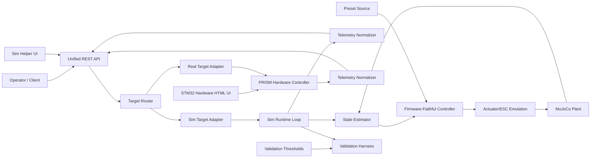

# PRISM Firmware-Faithful Digital Twin Specification

## 1) Purpose
This specification defines the architecture, fidelity requirements, and validation criteria for a PRISM MuJoCo digital twin that reproduces PRISM rotational haptic behavior and telemetry contract with engineering confidence.

Primary intent:
- Reproduce firmware haptic behavior (not just visual/mechanical behavior).
- Preserve stability characteristics that prevent oscillation in high-speed control.
- Provide a deterministic simulation mode for repeatable development and testing.

## 2) In-Scope Behaviors
- PRISM geometry represented as MuJoCo MJCF with:
  - Fixed PRISM core (`base_link` equivalent)
  - Rotational shaft joint (single DOF hinge)
  - Selectable handle mesh from handle library
- Firmware-faithful haptic torque behavior for all valve presets:
  - Viscous term
  - Coulomb friction with smoothing
  - Wall/end-stop stiffness + damping
  - Quiet-at-rest gate and safety clamping behavior
- Telemetry output compatible with firmware REST status semantics.
- Integration into larger MuJoCo scenes (robot manipulation compatible).

Out-of-scope for initial phase:
- Bit-level CAN protocol emulation.
- Exact MCU cycle-level timing emulation.
- Full network stack emulation from firmware.

## 3) Source of Truth
Authoritative behavior source files:
- `firmware/src/valve/valve_physics.c`
- `firmware/src/valve/valve_haptic.c`
- `firmware/src/valve/valve_presets.c`
- `firmware/src/valve/valve_nvm.c`
- `firmware/inc/valve/valve_haptic.h`
- `firmware/inc/config/valve.h`
- `firmware/src/network/rest_api.c`

Rule:
- Twin parameter defaults MUST be derived from firmware sources.
- Any discrepancy must be documented in a "Deviation" section.

## 4) Firmware-Faithful Haptic Model Requirements
The digital twin controller SHALL implement the same torque form as firmware HIL model:
- $\tau = -b\,\omega - \tau_c\,\mathrm{sgn}_\varepsilon(\omega) + \tau_{wall}(\theta,\omega)$
- With wall penetration logic and torque clamping matching firmware semantics.

Required runtime elements beyond raw equation:
- Quiet gate behavior.
- Torque clamp against active torque limits.
- Optional low-pass filtering stage for torque output.
- Passivity energy tank guard.
- Deterministic control update cadence equivalent to 1 kHz control logic.

## 5) Determinism and Real-Time Strategy
Two runtime modes are required:

1. Deterministic SIL mode (default for validation)
- Fixed control tick (1 kHz).
- Simulation-time lockstep execution.
- Reproducible outputs from identical inputs.

2. Realtime/HIL-like mode (for latency/jitter studies)
- Wall-clock paced execution.
- Explicit delay/jitter injection options.
- Non-deterministic timing accepted but measured.

Core rule:
- Control correctness is validated in deterministic SIL mode first.

## 6) ESC and Sensor Emulation Requirements
To avoid over-ideal simulation and hidden instability risks, the twin SHALL model:
- Actuator nonidealities:
  - Torque saturation
  - Slew-rate limiting
  - First-order torque lag
  - Optional command delay queue
- Sensor nonidealities:
  - Quantization
  - Optional timestamp delay
  - Optional staleness/dropout injection

All nonidealities must be configurable and disable-able.

## 7) Telemetry Contract Requirements
Twin telemetry MUST expose firmware-compatible status fields and units:
- `pos_deg`
- `vel_rad_s`
- `torque_nm`
- `status`

Recommended parity fields for diagnostics confidence:
- Temperature placeholders and safety block keys:
  - `temp_fet`
  - `temp_motor`
  - `bus_voltage`
  - `safety.errors`
  - `safety.last_error`
  - `safety.estops`

## 8) Validation and Confidence Framework
Confidence claims must be data-backed.

Required test classes:
- Static hold and micro-motion near zero velocity (chatter check)
- Step reversals
- Velocity sweeps/chirps
- Travel-limit impacts (wall interactions)
- Per-preset validation (Light/Medium/Heavy/Industrial)

Required metrics (per test and preset):
- Torque RMSE
- Torque peak error
- Settling time
- Overshoot
- Zero-crossing chatter count
- Phase lag (frequency tests)

Acceptance threshold policy:
- Define threshold table in validation config.
- Build fails when thresholds are violated.

## 9) Tuning Workflow
1. Lock firmware-parameter parity.
2. Run deterministic validation suite.
3. Tune only explicitly modeled nonidealities (lag/slew/quantization), not core firmware equations.
4. Re-run full validation and produce confidence report.

## 10) Deliverables
- Firmware-faithful controller module.
- Firmware-sourced preset configuration artifact.
- Telemetry adapter with firmware-compatible schema.
- Deterministic runner + realtime runner.
- Validation harness and report artifact.
- Updated project README with usage and limitations.

## 11) Definition of Done
System is considered robust and acceptable when:
- Firmware preset defaults match source-derived values.
- Telemetry schema is contract-compatible.
- Deterministic mode is reproducible.
- Validation suite passes across all presets.
- Residual deviations are documented with rationale and impact.

## 12) Modular Architecture and Contracts

### 12.1 Module Boundaries
The system SHALL be implemented as independent modules with explicit contracts:

1. Geometry Module
- Responsibility:
  - Load and define PRISM MJCF geometry/assets.
  - Define frame hierarchy (`world` -> `prism_mount` -> `prism_base` -> `prism_shaft`).
- Inputs:
  - STL files (`Top`, `Bottom`, `Shaft`) and per-mesh scale.
- Outputs:
  - Loaded MuJoCo model with named bodies/joint/actuator.

2. State Estimation Module
- Responsibility:
  - Read simulator state and produce controller-facing signals.
  - Apply optional sensor nonidealities (delay/quantization/dropout).
- Inputs:
  - MuJoCo `qpos`, `qvel`, simulation time.
  - Sensor nonideality configuration.
- Outputs:
  - `position_deg`, `omega_rad_s`, timestamps.

3. Haptic Controller Module (Firmware-Faithful)
- Responsibility:
  - Compute resistive torque from firmware-equivalent model and runtime guards.
  - Enforce quiet gate, clamp, filter, passivity logic.
- Inputs:
  - Estimated state, active preset/config, control dt.
- Outputs:
  - `torque_cmd_nm` (pre-actuator nonideality).

4. Actuator/ESC Emulation Module
- Responsibility:
  - Apply nonideal actuator behavior (lag/slew/saturation/delay).
- Inputs:
  - `torque_cmd_nm`, actuator nonideality config.
- Outputs:
  - `torque_applied_nm` sent to MuJoCo actuator control.

5. Runtime/Orchestration Module
- Responsibility:
  - Enforce control-loop cadence and mode semantics.
  - Own deterministic lockstep loop and realtime loop.
- Inputs:
  - Mode config (`SIL` or `Realtime`), control frequency.
- Outputs:
  - Ordered execution of modules each tick.

6. API Adapter Module (REST/HTML-Compatible)
- Responsibility:
  - Expose firmware-compatible command/status endpoints.
  - Translate REST requests into config/control updates.
- Inputs:
  - External HTTP requests.
- Outputs:
  - Contract-compatible JSON responses.

7. Validation Module
- Responsibility:
  - Execute scripted tests, compute metrics, evaluate thresholds.
  - Emit machine-readable confidence reports.
- Inputs:
  - Scenario definitions, thresholds, runtime outputs.
- Outputs:
  - Validation report and pass/fail status.

### 12.2 Contract Rules
- A module MAY depend only on declared input contracts, never on internal state of peer modules.
- Runtime module is the only owner of tick sequencing and clock semantics.
- API Adapter MUST NOT read MuJoCo internals directly; it MUST consume normalized state/telemetry from runtime/state modules.
- Validation module MUST run against public contracts (controller/runtime/API), not private internals.

## 13) Frame and World Deconfliction Contract

To avoid PRISM-vs-SIM frame ambiguity, the following frame contract is mandatory:

- `world`:
  - Global simulation frame used by robots and environment.
- `prism_mount`:
  - PRISM insertion frame. Only this frame is edited to place/orient PRISM in a larger world.
- `prism_base`:
  - Fixed PRISM base assembly (Top + Bottom rigidly attached).
- `prism_joint`:
  - Shaft rotational DOF about +Z axis in PRISM frame.

Critical explicit requirement:
- The joint between `prism_base` (Top+Bottom fixed body) and `prism_shaft` around +Z (`prism_joint`) is the sole target for PRISM haptic/control behavior.
- All virtual torque, command, telemetry interpretation, and user interaction act on this joint.

Rules:
- Do not move individual base meshes to position PRISM in scene.
- Scene integration changes `prism_mount` pose only.
- Shaft joint axis remains +Z; mesh alignment corrections use mesh/body local transforms only.

## 14) Data Contracts

### 14.1 Controller Tick Contract
Tick payload between modules per control cycle:

```json
{
  "t_s": "float",
  "dt_s": "float",
  "position_deg": "float",
  "omega_rad_s": "float",
  "active_preset": "LIGHT|MEDIUM|HEAVY|INDUSTRIAL",
  "torque_limit_nm": "float"
}
```

Controller output contract:

```json
{
  "torque_cmd_nm": "float",
  "quiet_active": "bool",
  "passivity_energy_j": "float"
}
```

### 14.2 Telemetry Contract (REST-Compatible)
Required payload keys and units:

```json
{
  "pos_deg": 0.0,
  "vel_rad_s": 0.0,
  "torque_nm": 0.0,
  "status": 2,
  "temp_fet": 0.0,
  "temp_motor": 0.0,
  "bus_voltage": 0.0,
  "safety": {
    "errors": 0,
    "last_error": 0,
    "estops": 0
  }
}
```

### 14.3 Preset/Config Contract
- Source artifact: generated firmware preset JSON.
- Runtime config must include:
  - Position range (`closed_position_deg`, `open_position_deg`)
  - `degrees_per_turn`
  - HIL parameters (`b`, `tau_c`, `k_w`, `c_w`, `eps`, `tau_max`)
- Any runtime override must be logged and traceable.

## 15) Timing and Determinism Contract

- Control frequency target: 1 kHz.
- Deterministic SIL mode:
  - Fixed `dt = 0.001 s` contract.
  - No wall-clock dependencies in control progression.
  - Same input seed and config must reproduce identical output traces.
- Realtime mode:
  - May include timing jitter and external latency.
  - Must still preserve module ordering and safety checks.

Execution order per tick (mandatory):
1. Read simulator state.
2. Apply sensor nonidealities.
3. Compute firmware-faithful controller torque.
4. Apply actuator nonidealities.
5. Apply actuator torque to plant.
6. Advance simulation.
7. Publish telemetry snapshot.

## 16) Architecture Diagram (Mermaid)



## 17) Implementation Mapping (Current Workspace)

This section binds contracts to current files:
- Geometry Module:
  - `prism_twin/models/prism_device.xml`
- Runtime/Viewer:
  - `prism_twin/simulation/run_sim.py`
  - `prism_twin/simulation/view_model.py`
- Controller Model:
  - `prism_twin/scripts/prism_physics.py`
- Nonidealities:
  - `prism_twin/simulation/nonidealities.py`
- Preset Source Pipeline:
  - `prism_twin/scripts/extract_firmware_presets.py`
  - `prism_twin/config/generated_firmware_presets.json`
- Validation:
  - `prism_twin/simulation/validate_twin.py`
  - `prism_twin/config/validation_thresholds.json`

## 18) Deviation Log Requirement

Any known mismatch vs firmware behavior shall be documented with:
- ID
- Description
- Why it exists
- Expected impact
- Plan to resolve

No release candidate should be declared "firmware-faithful" with undocumented deviations.

## 19) Strategic Decisions (2026-03-04)

### 19.1 Multi-Instance PRISM Support
Decision:
- The architecture SHALL support more than one simulated PRISM instance in a single world scene.

Contract:
- Every simulated PRISM must have a unique `instance_id` (string).
- Runtime, telemetry, and API calls must be scoped to `instance_id`.
- Default instance remains `prism_01` for backward compatibility.

Default placement contract (current baseline):
- `prism_01`: `prism_mount pos = (0, 0, 0)`, `quat = (1, 0, 0, 0)`
- `prism_02`: `prism_mount pos = (0, 0, 0.300)`, `quat = (0.70710678, 0.70710678, 0, 0)`

Implementation guidance:
- Model factory builds per-instance namespaced entities (e.g., `prism_01_joint`, `prism_02_joint`).
- API endpoints accept target by query/header/body and default explicitly to `prism_01` if omitted.

### 19.2 Sim vs Real Target Indication
Decision:
- UI and API responses SHALL explicitly indicate whether target is `sim` or `real`.

Contract:
- Add target metadata fields in status/config responses:
  - `target_kind`: `"sim" | "real"`
  - `target_id`: instance id or hardware id
- UI must render a persistent badge such as `SIM TARGET: prism_01` when connected to simulation.

### 19.3 Rigid Body Composition Contract
Decision:
- For simulation abstraction:
  - `Top + Bottom` are one rigid fixed body (`prism_base`).
  - `Shaft + selected handle geometry` are one rigid rotating body driven by `prism_joint`.

Contract:
- Handle meshes must be attached under the shaft body frame.
- No additional DOF between shaft and handle mesh assembly.

### 19.4 Handle Catalog and Metadata Contract
Decision:
- Handle selection will be driven by a handle metadata catalog.

Handle metadata schema (minimum):
- `handle_id`: unique string
- `mesh_folder`: relative assets folder
- `mesh_files`: ordered mesh list
- `units`: enum (`inches` | `mm` | `m`)
- `cad_axis_to_model_axis`: mapping rule (for now `Y_to_Z`)
- `z_offset_mm`: numeric (default `105`)
- `rigid_with_shaft`: bool (default `true`)

Default assumptions for incoming handles (as requested):
- units = inches
- z_offset_mm = 105
- folder contains all required meshes with common CAD origin

### 19.5 Sim-Specific Helper UI
Decision:
- A lightweight simulation helper UI SHALL be added.

Scope:
- Instance selector (`prism_01`, `prism_02`, ...)
- Handle selector (from handle catalog)
- Explicit target indicator (`SIM`)
- Apply/reload controls for handle swap

Integration option:
- Prefer embedding as a simulation-only widget in the existing HTML page path when in sim mode.

### 19.6 Interactive Handle Manipulation in MuJoCo Viewer
Decision:
- The simulator SHALL support interactive click-and-drag handle rotation while streaming telemetry.

Contract:
- Mouse drag maps to joint target/torque injection through the same controller pipeline.
- Telemetry output remains continuous and contract-compatible during interaction.
- Interaction must be instance-scoped.

Current milestone implementation status:
- Implemented now: helper UI mouse-drag slider sends continuous position updates to instance-scoped interaction endpoint.
- Deferred: native MuJoCo viewport mouse callback integration (higher complexity, lower priority for headless-first deployment).

### 19.7 Non-Goals for This Milestone
- No generalized articulation UI beyond PRISM interaction controls.
- No physical tool collision planner changes yet.
- No firmware HTTP stack binary emulation.

## 20) Next Milestone Scope

To realize the above strategy, the next milestone SHALL deliver:
1. Multi-instance runtime manager with `instance_id` routing.
2. API target metadata and instance selection support.
3. Handle catalog file and loader with defaults (inches, `Y_to_Z`, `z_offset_mm=105`).
4. Sim helper UI widget for instance + handle selection.
5. Viewer interaction mode for click-drag shaft rotation with telemetry.

## 22) API + UI Deployment Decision (Sim vs Real)

Decision:
- The project SHALL use one logical REST API contract with target routing (`sim` / `real`).
- UI deployment SHALL remain split by runtime environment:
  - Real hardware UI remains the STM32-hosted HTML page for hardware operation.
  - Simulation uses an independent helper UI hosted by the twin runtime.

Rationale:
- Simulation must run without STM32 dependency.
- Sim-specific controls (instance spawn, manual position slider, scene/debug controls) are not applicable to real hardware.
- This preserves a light-touch approach on real-hardware code and deployment while converging API semantics.

Contract rules:
- API responses always include `target_kind` and `target_id`.
- Sim-only controls must be explicitly rejected or hidden for `target_kind=real`.
- Shared controls (status/config/preset intent) use the same API schema across targets.

## 23) Large-Scene MuJoCo Integration Model

Goal:
- Avoid painting the twin into a corner; PRISM must be embeddable in larger scenes (e.g., robot manipulator interacting with PRISM).

Functional model:
1. PRISM remains a reusable scene component rooted at `prism_mount`.
2. Larger scene owns global `world` and additional bodies (robot arm, fixtures, tools).
3. Integration places PRISM by setting `prism_mount` pose only; internal PRISM frames/joint semantics remain unchanged.
4. Sim Target Adapter binds controller/runtime to the PRISM joint/actuator names in the composed MuJoCo model.
5. Telemetry/control remain instance-scoped so multiple PRISM devices can coexist in one scene.

Required capabilities for composed scenes:
- Attach-to-existing-model mode (controller/runtime can operate on a named PRISM instance inside a preloaded scene).
- Stable namespace convention for PRISM entities to avoid collisions.
- No assumptions that PRISM is the only articulated object in simulation.

Non-goal clarification:
- PRISM twin does not own robot planning/control; it exposes a stable PRISM interaction interface that a robot/scene controller can consume.

### 23.1 Current Viewer Behavior and Blocker Assessment

Current behavior (accepted for now):
- In standalone multi-instance runtime mode, each PRISM instance currently owns its own MuJoCo `MjModel`/`MjData` pair.
- Native `--with-viewer` mode renders one selected instance at a time.
- Switching visible instance is implemented by relaunching the native viewer against the selected instance (via API/UI routing).

Blocker assessment:
- This is not a fundamental MuJoCo limitation.
- The current constraint is architectural: instances are hosted as separate model/data worlds, so one passive viewer cannot display both simultaneously.

Required architecture for true concurrent same-viewer instances (and robot + PRISM scenes):
1. Use one composed MuJoCo world containing all PRISM mounts/instances and robot/environment bodies.
2. Replace per-instance model ownership with per-instance index maps into the shared model (`qpos`, `qvel`, actuator IDs, joint IDs).
3. Keep API/session semantics instance-scoped while execution runs on one shared simulation step.
4. Preserve namespace guarantees for all PRISM entities to avoid collisions in composed scenes.

Decision note:
- Temporary single-viewer switching is acceptable for current milestone UX.
- Long-term target remains concurrent visibility and interaction for multiple PRISMs in the same viewer and same world as the robot.

## 21) Requirement Traceability Matrix

| Requirement | Primary Module(s) | Validation / Check |
|---|---|---|
| Firmware preset source-of-truth | `scripts/extract_firmware_presets.py`, `scripts/prism_physics.py` | `scripts/preset_parity_report.py` |
| HIL torque behavior parity | `scripts/prism_physics.py`, `scripts/firmware_faithful_controller.py` | `simulation/validate_twin.py` metrics + thresholds |
| Deterministic 1 kHz loop | `simulation/run_sim.py` | deterministic replay in `simulation/validate_twin.py` |
| Sensor/actuator nonidealities | `simulation/nonidealities.py`, `simulation/run_sim.py` | profile metrics drift in `simulation/validate_twin.py` |
| Telemetry contract compatibility | `simulation/run_sim.py` | `scripts/check_telemetry_schema.py` |
| Frame deconfliction and insertion frame | `models/prism_device.xml` | MJCF load checks + visual inspection in `simulation/view_model.py` |
| Handle metadata and swapping | `config/handle_catalog.json`, `simulation/handle_catalog.py`, `simulation/instance_manager.py` | `scripts/validate_handle_catalog.py` + runtime swap endpoint tests |
| Multi-instance target routing | `simulation/instance_manager.py`, `simulation/twin_rest_server.py` | `/api/v1/instances` + instance-scoped `/api/v1/status` checks |